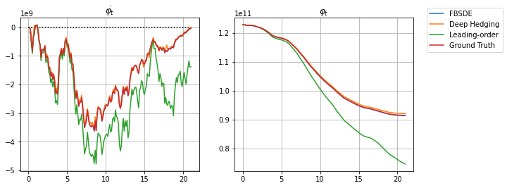

# Deep Learning Algorithms for Hedging with Frictions

This repository contains the Forward-Backward Stochastic Differential Equation (FBSDE) solver and the Deep Hedging, as described in reference [2]. Both of them are implemented in PyTorch.

## Basic Setup

The special case with following assumptions is considered:

* the dynamic of the market satisfies that return  and voalatility  are constant;
* the cost parameter  is constant;
* the endowment volatility is in the form of  where  is constant; 
* the frictionless strategy satisfies that    and 

On top of that, we consider two calibrated models: a quadratic transaction cost models, and a power cost model with elastic parameter of 3/2. In both experiments, the FBSDE solver and the Deep Hedging are implemented, as well as the asymptotic formula from Theorem 3.6 in reference [2].     
 
For the case of quadratic costs, the ground truth from equation (3.7) in reference [2] is also compared. See [`Script/sample_code_quadratic_cost.py`](./Script/sample_code_quadratic_cost.py) for details.   
 
For the case of 3/2 power costs, the ground truth is no longer available in closed form. Meanwhile, in regard to the asymptotic formula g(x) in equation (3.8) in reference [2], the numerical solution by [SciPy](https://github.com/scipy/scipy) is not stable, thus it is solved via MATHEMATICA (see [`Script/3on2cost_ODE.nb`](./Script/3on2cost_ODE.nb)). Consequently, the value of g(x) corresponding to x ranging from 0 to 50 by 0.0001, is stored in table [`Data/EVA.txt`](./Data/EVA.txt). Benefitted from the oddness and the growth conditions (equation (3.9) in reference [2]), the value of g(x) on  is obatinable. Following that, the numerical result of the asymptotic solution is compared with two machine learning methods. See [`Script/sample_code_3_2_cost.py`](./Script/sample_code_3_2_cost.py) for details.
  
The general variables and the market parameters in the code are summarized below:
| Variable | Meaning |
| --- | --- |
| `q`  | power of the trading cost, q |
| `S_OUTSTANDING` | total shares in the market, s |
| `TIME` | trading horizon, T |
| `TIME_STEP` |   time discretization, N |
| `DT ` |   |
| `GAMMA` | risk aversion,  |
| `XI_1` | endowment volatility parameter,  |
| `PHI_INITIAL` | initial holding,   |
| `ALPHA` | market volatility,   |
| `MU_BAR` | market return,   |
| `LAM` | trading cost parameter,  |
| `test_samples` | number of test sample path, batch_size |

## FBSDE solver
For the detailed implementation of the FBSDE solver, see [`Script/sample_code_FBSDE.py`](./Script/sample_code_FBSDE.py);      
The core dynamic is defined in the method `System.forward()`, and the key variables in the code are summarized below:   
| Variable | Meaning |
| --- | --- |
| `time_step` | time discretization, N |
| `n_samples` | number of sample path, batch_size |
| `dW_t`  | iid normally distributed random variables with mean zero and variance ,  |
| `W_t` | Brownian motion at time t,   |
|  `XI_t` | Brownian motion at time t,  |
| `sigma_t` | vector of 0 |
|  `sigmaxi_t` | vector of 1 |
|  `X_t` | vector of 1 |
|  `Y_t` | vector of 0 |
| `Lam_t` | 1 |
|  `in_t` | input of the neural network  |
|   `sigmaZ_t` | output of the neural network ,   |
| `Delta_t` | difference between the frictional and frictionless positions (the **forward component**) divided by the endowment parameter,  |
| `Z_t` | the **backward component**,  |

## Deep Hedging
For the detailed implementation of the Deep Hedging, see [`Script/sample_code_Deep_Hedging.py`](./Script/sample_code_Deep_Hedging.py);   
The core dynamic of the Deep Hedging is defined in the function `TRAIN_Utility()`, and the key variables in the code are summarized below:
| Variable | Meaning |
| --- | ---  |
| `time_step`  |   time discretization, N |
| `n_samples` | number of sample path, batch_size |
| `PHI_0_on_s` | initial holding divided by the total shares in the market,  |
| `W` | collection of the Brownian motion, throughout the trading horizon,  |
| `XI_W_on_s` | collection of the endowment volatility divided by the total shares in the market, throughout the trading horizon,  |
| `PHI_on_s` | collection of the frictional positions divided by the total shares in the market, throughout the trading horizon,  |
| `PHI_dot_on_s` | collection of the frictional trading rate divided by the total shares in the market, throughout the trading horizon,  |
| `loss_Utility` | minus goal function,  |

## Example
Here we proivde an example for the quadratic cost case (`q=2`) with the trading horizon of 21 days (`TIME=21`).    
 
The trading horizon is discretized in 168 time steps (`TIME_STEP=168`). The parameters are taken from the calibration in [1]:

| Parameter | Value | Code | 
| --- | ---  | --- | 
| agent risk aversion  |  | `GAMMA=1.66*1e-13` | 
|total shares outstanding | | `S_OUTSTANDING=2.46*1e11` |
|stock volatility  |  | `ALPHA=1.88`|
| stock return| |`MU_BAR=0.5*GAMMA*ALPHA**2` |
| endowment volatility parameter | | `XI_1=2.19*1e10` |
| trading cost parameter | | `LAM=1.08*1e-10`|

And these lead to the optimal trading rate (left panel) and the optimal position (right panel) illustrated below, leanrt by the FBSDE solver and the Deep Hedging, as well as the ground truth and the Leading-order solution based on the asymptotic formula:   

 
With the same simulation with test batch size of 3000 (`test_samples=3000`), the expectation and the standard deviation of the goal function  and the mean square error of the terminal trading rate are calculated, as summarized below:

| Method |  |  | 
| --- | ---  | --- | 
| FBSDE  |  |  | 
| Deep Q-learning  |  |  | 
| Leading Order Approximation  |   | | 
| Ground Truth |   | | 

See more examples and discussion in Section 4 of paper [2].   

<!-- 
## Authors

## License

This project is licensed under the [NAME HERE] License - see the LICENSE.md file for details
 -->
## Acknowledgments

## Reference
[1]  Asset Pricing with General Transaction Costs: Theory and Numerics, L. Gonon, J. Muhle-Karbe, X. Shi. [[Mathematical Finance]](https://onlinelibrary.wiley.com/doi/full/10.1111/mafi.12297), 2021.

[2]  Deep Learning Algorithms for Hedging with Frictions, X. Shi, D. Xu, Z. Zhang. [[arXiv]](https://arxiv.org), 2021. 
