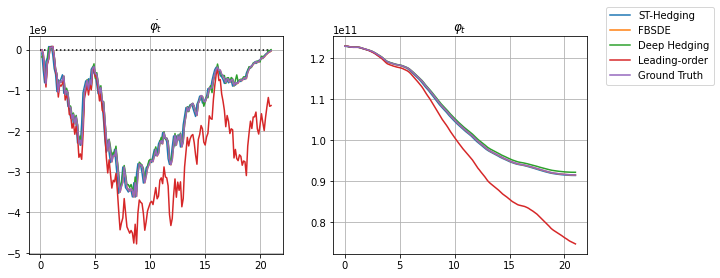
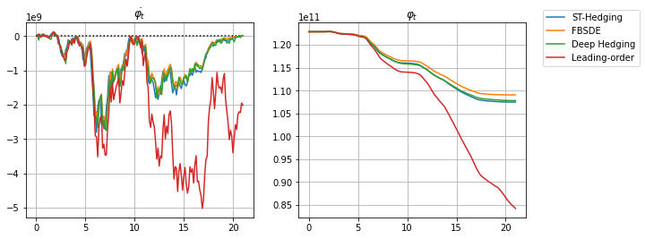
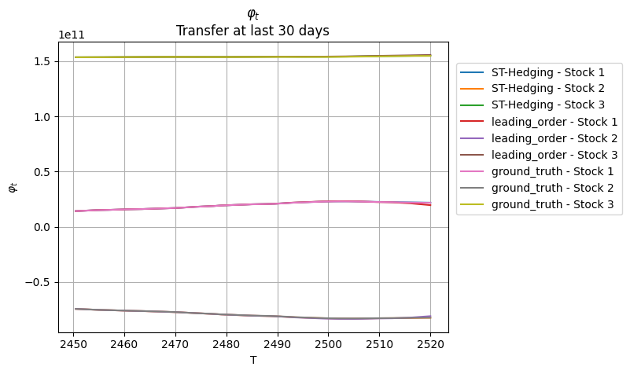

# Deep Learning Algorithms for Hedging with Frictions

This repository contains the Forward-Backward Stochastic Differential Equation (FBSDE) solver, the Deep Hedging, and the ST-Hedging, as described in reference [2]. All of them are implemented in PyTorch.

The special case with following assumptions is considered:

* the dynamic of the market satisfies that return  and voalatility  are constant;
* the cost parameter  is constant;
* the endowment volatility is in the form of  where  is constant; 
* the frictionless strategy satisfies that    and 

## Basic Setup for the case with a single stock

We consider two calibrated models: a quadratic transaction cost models, and a power cost model with elastic parameter of 3/2. In both experiments, the FBSDE solver, the Deep Hedging, and the ST-Hedging, are implemented, as well as the asymptotic formula from Equation (3.4) in reference [2].     
 
For the case of quadratic costs, the ground truth from equation (4.1) in reference [2] is also compared. See [`Script/sample_code_quadratic_cost.py`](./Script/sample_code_quadratic_cost.py) for details.   
 
For the case of 3/2 power costs, the ground truth is no longer available in closed form. Meanwhile, in regard to the asymptotic formula g(x) in equation (3.5) in reference [2], the numerical solution by [SciPy](https://github.com/scipy/scipy) is not stable, thus it is solved via MATHEMATICA (see [`Script/power_cost_ODE.nb`](./Script/power_cost_ODE.nb)). Consequently, the value of g(x) corresponding to x ranging from 0 to 50 by 0.0001, is stored in table [`Data/EVA.txt`](./Data/EVA.txt). Benefitted from the oddness and the growth conditions (equation (A.5) in reference [2]), the value of g(x) on  is obatinable. Following that, the numerical result of the asymptotic solution is compared with two machine learning methods. See [`Script/sample_code_power_cost.py`](./Script/sample_code_power_cost.py) for details.
  
The general variables and the market parameters in the code are summarized below:
| Variable | Meaning |
| --- | --- |
| `q`  | power of the trading cost, q |
| `S_OUTSTANDING` | total shares in the market, s |
| `TIME` | trading horizon, T |
| `TIME_STEP` |   time discretization, N |
| `DT ` |   |
| `GAMMA` | risk aversion,  |
| `XI_1` | endowment volatility parameter,  |
| `PHI_INITIAL` | initial holding,   |
| `ALPHA` | market volatility,   |
| `MU_BAR` | market return,   |
| `LAM` | trading cost parameter,  |
| `test_samples` | number of test sample path, batch_size |

## Basic Setup for the case with multiple stocks

For high dimensional case with three stocks, we consider the quadratic transaction cost model. The asymptotic formula from Equation (3.4) in reference [2], and the ground truth from equation (4.1) in reference [2] are included in `leading_order_quad` and `ground_truth` of `DynamicsFactory` class in 
[`SingleAgent-Stage2/SingleAgentPipe.py`](./SingleAgent-Stage2/SingleAgentPipe.py). And we implement the ST-Hedging algorithm illustrated in Section (4.3) in reference [2]. 
  
The general variables and the market parameters in the code are summarized below:
| Variable | Meaning |
| --- | --- |
| `N_STOCK` | dimension of the stocks |
| `S_OUTSTANDING` | total shares in the market, s |
| `TR` | trading horizon, T |
| `T` |   time discretization, N |
| `BM_COV` |  Covariance matrix of the high dimensional Brownian Motion,  an identity matrix. |
| `GAMMA` | risk aversion,  |
| `xi_dd` | endowment volatility parameter,  |
| `alpha_stmd` | market volatility,   |
| `mu_stm` | market return,   |
| `lam_mm` | trading cost parameter,  |
| `N_SAMPLE` | number of test sample path, batch_size |

## FBSDE solver
### Case for the Single Stock
For the detailed implementation of the FBSDE solver, see [`Script/sample_code_FBSDE.py`](./Script/sample_code_FBSDE.py);      
The core dynamic is defined in the method `System.forward()`, and the key variables in the code are summarized below:   
| Variable | Meaning |
| --- | --- |
| `time_step` | time discretization, N |
| `n_samples` | number of sample path, batch_size |
| `dW_t`  | iid normally distributed random variables with mean zero and variance ,  |
| `W_t` | Brownian motion at time t,   |
|  `XI_t` | Brownian motion at time t,  |
| `sigma_t` | vector of 0 |
|  `sigmaxi_t` | vector of 1 |
|  `X_t` | vector of 1 |
|  `Y_t` | vector of 0 |
| `Lam_t` | 1 |
|  `in_t` | input of the neural network  |
|   `sigmaZ_t` | output of the neural network ,   |
| `Delta_t` | difference between the frictional and frictionless positions (the **forward component**) divided by the endowment parameter,  |
| `Z_t` | the **backward component**,  |

### Case for Multiple Stocks
For the detailed implementation of the FBSDE solver, see the class `DynamicsFactory` in 
[`SingleAgent-Stage2/SingleAgentPipe.py`](./SingleAgent-Stage2/SingleAgentPipe.py);      
The core dynamic is defined in the function `fbsde_quad`, and the key variables in the code are summarized below:   
| Variable | Meaning |
| --- | --- |
| `dW_std`  | iid normally distributed random variables with mean zero and variance ,  |
| `W_std` | 3-dimsion Brownian motion at time t,   |
| `xi_std_w` | collection of the endowment volatility, throughout the trading horizon,  |
|  `x` | input of the neural network  |
|   `Z_stmd` | output of the neural network ,   |
| `phi_stm` | collection of the frictional positions throughout the trading horizon,  |
| `phi_stm_bar` | collection of the frictionless positions throughout the trading horizon,  |
| `phi_dot_stm` | collection of the frictional trading rate throughout the trading horizon,  |

## Deep Hedging
### Case for the Single Stock
For the detailed implementation of the Deep Hedging, see [`Script/sample_code_Deep_Hedging.py`](./Script/sample_code_Deep_Hedging.py);   
The core dynamic of the Deep Hedging is defined in the function `TRAIN_Utility()`, and the key variables in the code are summarized below:
| Variable | Meaning |
| --- | ---  |
| `time_step`  |   time discretization, N |
| `n_samples` | number of sample path, batch_size |
| `PHI_0_on_s` | initial holding divided by the total shares in the market,  |
| `W` | collection of the Brownian motion, throughout the trading horizon,  |
| `XI_W_on_s` | collection of the endowment volatility divided by the total shares in the market, throughout the trading horizon,  |
| `PHI_on_s` | collection of the frictional positions divided by the total shares in the market, throughout the trading horizon,  |
| `PHI_dot_on_s` | collection of the frictional trading rate divided by the total shares in the market, throughout the trading horizon,  |
| `loss_Utility` | minus goal function,  |

### Case for Multiple Stocks
For the detailed implementation of the Deep Hedging, see the class `DynamicsFactory` in 
[`SingleAgent-Stage2/SingleAgentPipe.py`](./SingleAgent-Stage2/SingleAgentPipe.py);      
The core dynamic is defined in the function `deep_hedging`, and the key variables in the code are summarized below:   
| Variable | Meaning |
| --- | ---  |
| `dW_std`  | iid normally distributed random variables with mean zero and variance ,  |
| `W_std` | 3-dimsion Brownian motion at time t,   |
| `xi_std_w` | collection of the endowment volatility, throughout the trading horizon,  |
|  `x` | input of the neural network  |
| `phi_stm` | collection of the frictional positions throughout the trading horizon,  |
| `phi_stm_bar` | collection of the frictionless positions throughout the trading horizon,  |
| `phi_dot_stm` | output of the neural network , collection of the frictional trading rate throughout the trading horizon,  |

## ST-Hedging Algorithm
For the detailed implementation of the ST-Hedging Algorithm, see the class `DynamicsFactory` in 
[`SingleAgent-Stage2/SingleAgentPipe.py`](./SingleAgent-Stage2/SingleAgentPipe.py);      
The core dynamic is defined in the function `st_hedging`, and the key variables in the code are summarized below:   
| Variable | Meaning |
| --- | ---  |
| `M`  | cut-off value for the trading horizon considered as long enough for the leading-order solution   |
| `phi_stm` | collection of the frictional positions throughout the trading horizon: taking the value of the leading-order solution from time 0 to M, and the value of the Deep Hedging from time M to the end of trading horizon, T |
| `phi_dot_stm` | collection of the frictional trading rate throughout the trading horizon, taking the value of the leading-order solution from time 0 to M, and the value of the Deep Hedging from time M to the end of trading horizon, T|
| `phi_stm_leading_order` | collection of the frictional positions from the initial time to time M, given by the leading-order solution|
| `phi_dot_stm_leading_order` | collection of the frictional trading rate from the initial time to time M, given by the leading-order solution|
| `phi_stm_deep_hedging` | collection of the frictional positions from time M to the end of trading horizon, given by the deep hedging|
| `phi_dot_stm_deep_hedging` | collection of the frictional trading rate from time M to the end of trading horizon, given by the deep hedging|
| `phi_0` | initial value of frictional position for the deep heding, given by the leading-order formula at the cut-off time at time M,   |

## Example  
### Single Stock
#### Quatratic Cost
Here we proivde an example for the quadratic cost case (`q=2`) with the trading horizon of 21 days (`TIME=21`).    
 
The trading horizon is discretized in 168 time steps (`TIME_STEP=168`). The parameters are taken from the calibration in [1]:

| Parameter | Value | Code | 
| --- | ---  | --- | 
| agent risk aversion  |  | `GAMMA=1.66*1e-13` | 
|total shares outstanding | | `S_OUTSTANDING=2.46*1e11` |
|stock volatility  |  | `ALPHA=1.88`|
| stock return| |`MU_BAR=0.5*GAMMA*ALPHA**2` |
| endowment volatility parameter | | `XI_1=2.19*1e10` |
| trading cost parameter | | `LAM=1.08*1e-10`|

And these lead to the optimal trading rate (left panel) and the optimal position (right panel) illustrated below, leanrt by the FBSDE solver, the Deep Hedging, and the ST-Hedging as well as the ground truth and the Leading-order solution based on the asymptotic formula:   

<!--[TR=21_q=2](./Gallery/single_quad_21.png)-->

 
With the simulation of a test batch size of 3000 (`test_samples=3000`), the expectation and the standard deviation of the goal function  and the mean square error of the terminal trading rate are calculated, as summarized below:

| Method |  |  | 
| --- | ---  | --- | 
| FBSDE Solver  |  |  | 
| Deep Hedging  |  |  | 
| ST Hedging  |  |  | 
| Leading Order Approximation  |   | | 
| Ground Truth |   | | 

#### 3/2 Power Cost
Here we proivde an example for the 3/2 power cost case (`q=3/2`) with the trading horizon of 21 days (`TIME=21`).    
 
The trading horizon is discretized in 168 time steps (`TIME_STEP=168`). The parameters are taken from the calibration in [1]:

| Parameter | Value | Code | 
| --- | ---  | --- | 
| agent risk aversion  |  | `GAMMA=1.66*1e-13` | 
|total shares outstanding | | `S_OUTSTANDING=2.46*1e11` |
|stock volatility  |  | `ALPHA=1.88`|
| stock return| |`MU_BAR=0.5*GAMMA*ALPHA**2` |
| endowment volatility parameter | | `XI_1=2.19*1e10` |
| trading cost parameter | | `LAM=5.22e-6`|

And these lead to the optimal trading rate (left panel) and the optimal position (right panel) illustrated below, leanrt by the FBSDE solver, the Deep Hedging, and the ST-Hedging as well as the Leading-order solution based on the asymptotic formula:   

 
With the simulation of a test batch size of 3000 (`test_samples=3000`), the expectation and the standard deviation of the goal function  and the mean square error of the terminal trading rate are calculated, as summarized below:

| Method |  |  | 
| --- | ---  | --- | 
| FBSDE Solver  |  |  | 
| Deep Hedging  |  |  | 
| ST Hedging  |  |  | 
| Leading Order Approximation  |   | | 

### Multiple Stocks
To illustrate the scalability of our ST-Hedging algorithm, we proivde an example with three risky assets in the market with cross sectional effect, under the quadratic cost case (`q=2`).
The trading horizon is 2520 days (`TR=2520`), discretized in 2520 time steps (`T=2520`), and the switching threshold is 100 days before maturity.

 The parameters are taken from the calibration in [1]:

| Parameter | Value | Code | 
| --- | ---  | --- | 
| agent risk aversion  |  | `GAMMA = 1/(1/ (8.91*1e-13) + 1/ (4.45 * 1e-12) )` | 
|total shares outstanding | | `S_OUTSTANDING = torch.tensor([1.15, 0.32, 0.23]) *1e10` |
|stock volatility  |  | `sigma_big = torch.tensor([[72.00, 71.49, 54.80],[71.49, 85.42, 65.86],[54.80, 65.86, 56.84]])`|
| stock return| |`mu_stm = torch.ones((n_sample, time_len, N_STOCK)) * torch.tensor([[2.99, 3.71, 3.55]])` |
| endowment volatility parameter | | `xi_dd = torch.tensor([[ -2.07, 1.91, 0.64],[1.91, -1.77, -0.59],[0.64 ,-0.59 ,-0.20]]) *1e9` |
| trading cost parameter | | ` lam_mm = torch.diag(torch.tensor([0.1269, 0.1354, 0.1595])) * 1e-8`|

And these lead to the optimal position (the first plot) and the optimal trading rates illustrated below (we only include the tradings in the last 30 days), leanrt by the ST-Hedging as well as the ground truth and the Leading-order solution based on the asymptotic formula:   
 
 
 
With the simulation of a test batch size of 3000 (`N_SAMPLE = 3000`), the expectation and the standard deviation of the goal function  and the mean square error of the terminal trading rate are calculated, as summarized below:

| Method |  |  | 
| --- | ---  | --- | 
| ST Hedging  |  |  | 
| Leading Order Approximation  |   | | 
| Ground Truth |   | | 

See more examples and discussion in Section 4 of paper [2].   

<!-- 
## Authors

## License

This project is licensed under the [NAME HERE] License - see the LICENSE.md file for details
 -->
## Acknowledgments

## Reference
[1]  Asset Pricing with General Transaction Costs: Theory and Numerics, L. Gonon, J. Muhle-Karbe, X. Shi. [[Mathematical Finance]](https://onlinelibrary.wiley.com/doi/full/10.1111/mafi.12297), 2021.

[2]  Deep Learning Algorithms for Hedging with Frictions, X. Shi, D. Xu, Z. Zhang. [[arXiv]](https://arxiv.org/abs/2111.01931#), 2021. 
